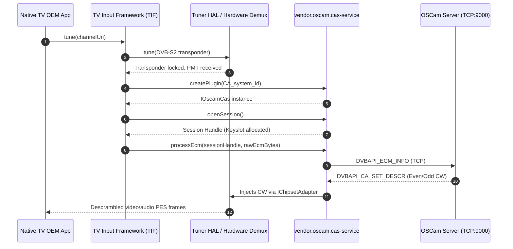
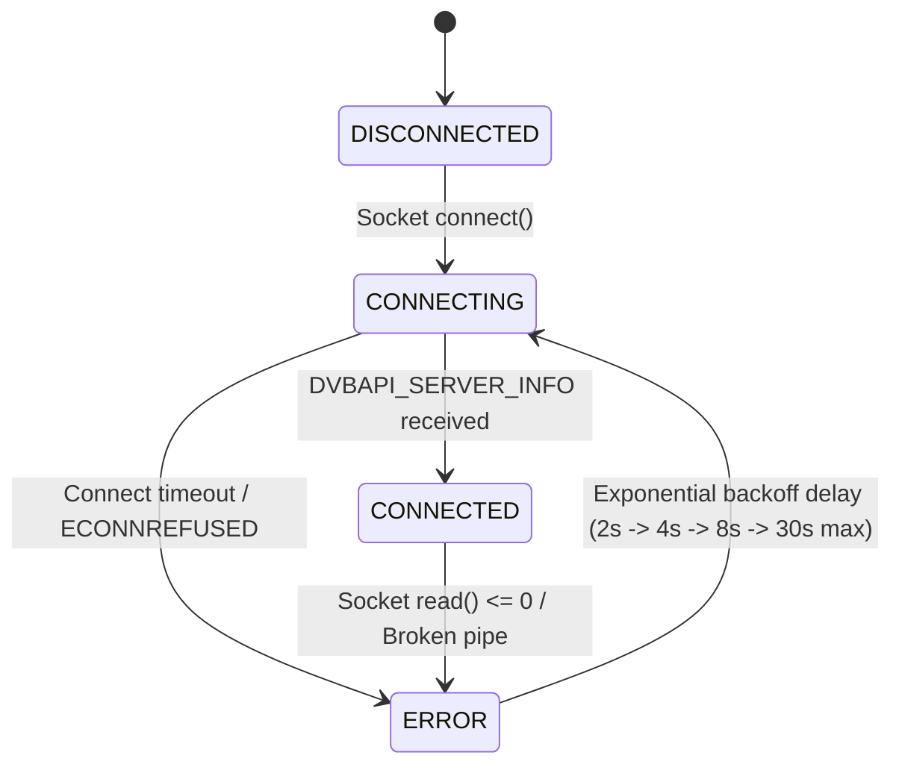

# Technical Architecture & Engineering Design

This document details the internal architecture, protocol specifications, framework integrations, and hardware abstraction layer of the **Android TV OSCam CAS Bridge**.

---

## Table of Contents

1. [High-Level Architecture](#1-high-level-architecture)
2. [Android MediaCas & Tuner HAL Integration](#2-android-mediacas--tuner-hal-integration)
3. [MPEG-TS PMT & CA Descriptor Parsing](#3-mpeg-ts-pmt--ca-descriptor-parsing)
4. [OSCam DVBAPI Protocol Specification](#4-oscam-dvbapi-protocol-specification)
5. [Multi-Vendor Chipset Abstraction Layer (CAL)](#5-multi-vendor-chipset-abstraction-layer-cal)
6. [Software DVB-CSA Descrambler Engine](#6-software-dvb-csa-descrambler-engine)
7. [Zero-Recompile Hot-Reload Mechanism](#7-zero-recompile-hot-reload-mechanism)
8. [Thread Safety & Concurrency Model](#8-thread-safety--concurrency-model)

---

## 1. High-Level Architecture

The bridge operates across three distinct execution domains:

1. **Android Framework Layer (Java/Kotlin)**:
   - Manages user settings, Leanback TV UI, DataStore preferences, and the embedded Web Console Pro (port 8080).
   - Runs `OscamCasBinderService` as a persistent foreground service with partial WakeLock to prevent CPU throttling on low-power TV SoCs.
   - Hosts `StreamDescramblerServer` on port 9191 for external media players (VLC, Kodi).

2. **Native HAL Daemon (`vendor.oscam.cas-service`)**:
   - Implements `vendor.oscam.cas.IOscamCasService` via Android AIDL.
   - Registers in the Android VINTF manifest as a trusted CAS plugin.
   - Manages session handles, ECM filters, and hardware descrambler keyslots.

3. **C++ Core Engine (`liboscam_bridge.a` & `liboscam_chipset.a`)**:
   - Maintains the TCP client connection to the domestic OSCam server using the `dvbapi` binary protocol.
   - Implements the Chipset Abstraction Layer (CAL) with direct ioctl access to SoC demux drivers.
   - Provides the in-memory DVB-CSA v1/v2 software descrambling pipeline.

```
                    ┌─────────────────────────────────────────────────────────┐
                    │                   Android TV Framework                  │
                    │                                                         │
                    │  [Native TV App]               [Web Console Pro (8080)] │
                    │         │                                  │            │
                    │         ▼                                  ▼            │
                    │  [TIF / MediaCas]               [DataStore Repository]  │
                    │         │                                  │            │
                    │         ▼ (AIDL IPC)                       ▼            │
                    │  [OscamCasService]              [/data/vendor/oscam]    │
                    │         │                           (config.json)       │
                    │         ▼                                  │            │
                    │  [OscamCasPlugin] ◄─── (inotify watcher) ──┘            │
                    │         │                                               │
                    │         ├──► [IChipsetAdapter] ──► Hardware Demux (SoC) │
                    │         │                                               │
                    │         ├──► [SoftwareDescrambler] ──► Stream (9191)    │
                    │         │                                               │
                    │         ▼                                               │
                    │  [DvbapiClient]                                         │
                    └─────────┼───────────────────────────────────────────────┘
                              │ TCP Socket (dvbapi network protocol)
                              ▼
                   ┌─────────────────────┐
                   │ Local OSCam Server  │
                   │  - Physical Card    │
                   │  - Port 9000        │
                   └─────────────────────┘
```

---

## 2. Android MediaCas & Tuner HAL Integration

### Broadcast Tuning Sequence

When a user selects an encrypted satellite or terrestrial channel in an Android TV app (e.g. Google Live Channels, TCL Channel App, Sony TV Input):



### AIDL Service Definition
The service implements three standard AIDL interfaces located in `hal/aidl/vendor/oscam/cas/`:

1. **`IOscamCasService.aidl`**:
   - `createPlugin(int caSystemId)`: Instantiates a CAS session handler.
   - `isSystemIdSupported(int caSystemId)`: Returns `true` if the CAID matches the user's active delivery profile.

2. **`IOscamCas.aidl`**:
   - `openSession()`: Allocates internal keyslot and session structures.
   - `setSessionPrivateData(byte[] pmtBytes)`: Receives raw PMT section data.
   - `processEcm(byte[] ecmData)`: Forwards ECM packet for descrambling.
   - `processEmm(byte[] emmData)`: Forwards EMM packet for subscription entitlement updates.
   - `closeSession()`: Releases allocated hardware keyslot.

3. **`IOscamCasListener.aidl`**:
   - `onEvent(int event, int arg, byte[] data)`: Notifies framework of state transitions.
   - `onControlWordReceived(int sessionHandle, byte[] cwData)`: Dispatches CW events.

---

## 3. MPEG-TS PMT & CA Descriptor Parsing

The `SatellitePmtParser` (`bridge/SatellitePmtParser.cpp`) processes raw MPEG-TS Program Map Table (PMT) sections (table ID `0x02`):

1. **Section Header Verification**:
   - Table ID must equal `0x02`.
   - `section_syntax_indicator` bit must equal `1`.
   - Evaluates `section_length` and verifies CRC32 checksum.

2. **Program Information Loop**:
   - Extracts `program_info_length`.
   - Scans descriptors for Tag `0x09` (**CA Descriptor**).

3. **Elementary Stream Loop**:
   - Iterates through video and audio streams (`stream_type`, `elementary_PID`, `ES_info_length`).
   - Parses ES-level CA descriptors.

### CA Descriptor Structure (Tag `0x09`):
```
 0                   1                   2                   3
 0 1 2 3 4 5 6 7 8 9 0 1 2 3 4 5 6 7 8 9 0 1 2 3 4 5 6 7 8 9 0 1
+-+-+-+-+-+-+-+-+-+-+-+-+-+-+-+-+-+-+-+-+-+-+-+-+-+-+-+-+-+-+-+-+
|Descriptor Tag |Descriptor Len |         CA_system_id          |
|    (0x09)     |    (>= 4)     |            (CAID)             |
+-+-+-+-+-+-+-+-+-+-+-+-+-+-+-+-+-+-+-+-+-+-+-+-+-+-+-+-+-+-+-+-+
|Reserved |     CA_PID (ECM)    |   Private Data (Provider ID)  |
|  (111)  |       (13-bit)      |          (Optional)           |
+-+-+-+-+-+-+-+-+-+-+-+-+-+-+-+-+-+-+-+-+-+-+-+-+-+-+-+-+-+-+-+-+
```

When a CA descriptor matches one of the user's active CAIDs (e.g. `0x1810` for Movistar+, `0x1830` for HD+ Astra), the bridge registers the ECM PID and initiates filtering.

---

## 4. OSCam DVBAPI Protocol Specification

The bridge uses OSCam's native network `dvbapi` protocol over a local TCP socket. Packets are framed as follows:

```
 0                   1                   2                   3
 0 1 2 3 4 5 6 7 8 9 0 1 2 3 4 5 6 7 8 9 0 1 2 3 4 5 6 7 8 9 0 1
+-+-+-+-+-+-+-+-+-+-+-+-+-+-+-+-+-+-+-+-+-+-+-+-+-+-+-+-+-+-+-+-+
|     Opcode High     |      Opcode Low      |   Payload Len MSB  |
+-+-+-+-+-+-+-+-+-+-+-+-+-+-+-+-+-+-+-+-+-+-+-+-+-+-+-+-+-+-+-+-+
|Payload Len LSB|             Payload Data ...                  |
+-+-+-+-+-+-+-+-+-+-+-+-+-+-+-+-+-+-+-+-+-+-+-+-+-+-+-+-+-+-+-+-+
```

### Core Protocol Opcodes:

| Opcode Hex | Identifier | Direction | Description |
|---|---|---|---|
| `0x0001` | `DVBAPI_SERVER_INFO` | Server ➔ Client | Server version, supported protocol level, capabilities |
| `0x0002` | `DVBAPI_ECM_INFO` | Client ➔ Server | Encapsulated ECM packet with Service ID, CAID, and PMT info |
| `0x0003` | `DVBAPI_CA_SET_DESCR` | Server ➔ Client | Resolved Control Word (CW) keys (8 or 16 bytes, Even/Odd parity) |
| `0x0004` | `DVBAPI_CA_SET_PID` | Client ➔ Server | Registers an active Elementary Stream PID with the descrambler |
| `0x0005` | `DVBAPI_CLIENT_INFO` | Client ➔ Server | Client name, version, and protocol negotiation |
| `0x0006` | `DVBAPI_STOP_FILTER` | Client ➔ Server | Demux filter termination notification |

### Reconnect State Machine:



---

## 5. Multi-Vendor Chipset Abstraction Layer (CAL)

Different television SoC vendors implement proprietary ioctls and character devices for their hardware transport stream demultiplexers. The bridge encapsulates all vendor-specific code behind `IChipsetAdapter` (`chipset/include/IChipsetAdapter.h`):

```cpp
class IChipsetAdapter {
public:
    virtual ~IChipsetAdapter() = default;
    virtual bool initialize() = 0;
    virtual bool setControlWord(uint16_t pid, Parity parity, const uint8_t* cw, size_t length) = 0;
    virtual bool allocateKeySlot(uint16_t pid, int& outKeySlot) = 0;
    virtual bool releaseKeySlot(int keySlot) = 0;
    virtual const char* getChipsetName() const = 0;
};
```

### Driver Implementation Matrix:

1. **Amlogic (`AmlogicAdapter.cpp`)**:
   - Device nodes: `/dev/amstream_mpps`, `/dev/dvb0.ca0`
   - Interacts with Amlogic Demux CA driver using `AMSTREAM_IOC_SET_CW` ioctl.
   - Maps PIDs to internal hardware keyslots (0 to 31).

2. **MediaTek (`MediaTekAdapter.cpp`)**:
   - Device nodes: `/dev/mtk_ca0`, `/dev/dvb0.ca0`
   - Interacts with MediaTek TS Demux driver. Sets 8-byte CW keys with parity flag in MTK demux hardware register table.

3. **Realtek (`RealtekAdapter.cpp`)**:
   - Device nodes: `/dev/rtd_ca0`, `/dev/rtk_dvb`
   - Uses Realtek RTD series DVB descrambler ioctls for hardware CW injection.

4. **Broadcom (`BroadcomAdapter.cpp`)**:
   - Device nodes: `/dev/bcm_ca0`, `/dev/dvb0.ca0`
   - Broadcom BCM7xxx family hardware descrambler key ladder interface.

5. **Synaptics (`SynapticsAdapter.cpp`)**:
   - Device nodes: `/dev/galois_ca0`
   - Synaptics VideoSmart (Galois) demux architecture.

6. **Novatek (`NovatekAdapter.cpp`)**:
   - Device nodes: `/dev/nvt_ca0`
   - Novatek NT72xxx digital TV demux driver.

### Runtime SoC Detection (`ChipsetDetector.cpp`):
At startup, `ChipsetDetector::detect()` examines:
- `ro.board.platform` (e.g. `meson`, `mt5895`, `rtd2851`, `bcm72180`, `berlin`, `nt72671`)
- `ro.hardware` (e.g. `amlogic`, `mtk`, `realtek`)
- Presence of filesystem device nodes (`/dev/amstream_mpps`, `/dev/mtk_ca0`, etc.)

---

## 6. Software DVB-CSA Descrambler Engine

For content that is not processed through the TV's physical hardware tuner (such as local `.ts` files on external USB drives, network SAT>IP streams, or RTSP feeds), the bridge provides a software DVB-CSA v1/v2 engine (`bridge/SoftwareDescrambler.cpp`).

### Algorithmic Pipeline:
1. **Key Schedule Generation**:
   - Expands the 8-byte Control Word into 56 7-bit sub-keys ($K_1 \dots K_{56}$) via permutation and circular shifts.
2. **MPEG-TS Header Evaluation**:
   - Checks the 4-byte TS packet header:
     - Sync byte: must equal `0x47`.
     - `transport_scrambling_control` bits:
       - `00`: Clear packet (bypasses descrambler).
       - `10`: Scrambled with **EVEN** key.
       - `11`: Scrambled with **ODD** key.
3. **Payload Descrambling**:
   - Stream cipher descrambles 8-byte blocks in reverse order.
   - Resets transport scrambling control bits to `00` in the output packet.

### Stream Descrambler Proxy (`StreamDescramblerServer.kt`):
Runs on port `9191` and acts as a high-speed HTTP chunked stream proxy:
- Buffers MPEG-TS data in multiples of 188 bytes ($348 \times 188 = \sim 65\text{ KB}$).
- Descrambles packets in-place in memory.
- Streams clear video directly to client players (VLC, Kodi, ExoPlayer) with negligible latency.

---

## 7. Zero-Recompile Hot-Reload Mechanism

The bridge utilizes POSIX `inotify` file watchers to update server addresses, ports, and CAID filters dynamically without restarting:

```
  [User Action]
   - Web Console Pro (http://<TV_IP>:8080)  ──► Updates DataStore Preferences
   - TV Settings Leanback Menu               ──► Writes /data/vendor/oscam/config.json
                                                        │
                                                        ▼ (POSIX inotify IN_MODIFY)
                                             [ConfigWatcher Thread]
                                                        │
                                                        ▼
                                             [OscamCasPlugin::reloadConfig()]
                                                        │
                                                        ├── Updates active CAID filters
                                                        └── Reconnects DvbapiClient
```

- Detection latency: **< 500 ms**.
- Active TV viewing is not interrupted unless the server IP or port itself is changed.

---

## 8. Thread Safety & Concurrency Model

- **Lock-Free Event Logging**: Logs are stored in a `ConcurrentLinkedDeque` ring buffer limited to the most recent 250 entries.
- **Coroutines for Non-Blocking I/O**: The Kotlin web server and stream proxy run on `Dispatchers.IO`. Concurrent ping operations use `async`/`awaitAll` to test all configured servers in parallel.
- **Mutex Protected Socket Client**: Native `DvbapiClient` synchronizes socket writes using `std::mutex` to prevent interleaved binary packet transmission across concurrent threads.
- **Thread Separation**:
  - Thread 1: AIDL binder dispatch loop (`vendor.oscam.cas-service`).
  - Thread 2: DVBAPI TCP receiver & heartbeat loop.
  - Thread 3: Newcamd v5.25 TCP worker & keepalive loop.
  - Thread 4: POSIX inotify file system watcher.
  - Thread 5: Local HTTP Management Server (port 8080).
  - Thread 6: Local HTTP Stream Descrambler Proxy (port 9191).

---

## 9. Multi-Protocol Engine & Newcamd v5.25 Architecture

To support diverse domestic cardsharing environments, the bridge integrates a multi-protocol networking layer capable of handling both **OSCam DVBAPI** and **Newcamd v5.25** connections simultaneously.

```
                   ┌──────────────────────────────────────────────┐
                   │            OscamCasPlugin (C++)              │
                   └───────┬──────────────────────────────┬───────┘
                           │                              │
         Protocol == DVBAPI│                              │Protocol == NEWCAMD
                           ▼                              ▼
                 ┌───────────────────┐          ┌───────────────────┐
                 │   DvbapiClient    │          │   NewcamdClient   │
                 └─────────┬─────────┘          └─────────┬─────────┘
                           │                              │
                           │                              ├── [3DES EDE2 Engine]
                           │                              ├── [DES Key Permutation]
                           │                              └── [14-Byte XOR Key Derivation]
                           ▼                              ▼
               ┌───────────────────────┐      ┌───────────────────────┐
               │ OSCam [dvbapi] Server │      │  Newcamd v5.25 Server │
               │  (Port 9000, unencr)  │      │  (Port 10000+, 3DES)  │
               └───────────────────────┘      └───────────────────────┘
```

### Self-Contained Triple-DES Cryptographic Engine (`NewcamdClient.cpp`)
The Newcamd v5.25 client incorporates a zero-dependency, bit-level implementation of the Data Encryption Standard (DES) and Triple-DES (EDE2):
1. **Permuted Choice & S-Boxes**: Full standard PC-1 (56-bit), PC-2 (48-bit), Initial Permutation (IP), Final Permutation (FP), and S-Boxes 1–8 embedded directly in native C++. No external OpenSSL or BoringSSL dynamic linkage is required, ensuring universal compatibility across Android NDK architectures (`arm64-v8a`, `armeabi-v7a`, `x86_64`).
2. **Session Key XOR Derivation**:
   - Upon initial TCP connection, the Newcamd server transmits a 14-byte random initialization vector ($IV_{srv}$).
   - The client derives a 16-byte session key ($K_{sess}$) by XOR-combining the configured 14-byte DES user key ($K_{des}$) with $IV_{srv}$, expanding to 16 bytes:
     $$K_{sess}[i] = K_{des}[i] \oplus IV_{srv}[i] \quad (i = 0 \dots 13)$$
     $$K_{sess}[14] = K_{sess}[0] \oplus K_{sess}[1], \quad K_{sess}[15] = K_{sess}[2] \oplus K_{sess}[3]$$
3. **Handshake & Login Sequence**:
   - **`0xE0` (Login Request)**: Username string and DES-hashed password encrypted via Triple-DES with $K_{sess}$.
   - **`0xE1` (Login Acknowledgement)**: Server responds with card capabilities, available CAID, and provider IDs.
4. **ECM Dispatch & CW Extraction**:
   - ECMs are framed with standard Newcamd headers (`0x80` even / `0x81` odd), padded to 8-byte boundaries, and 3DES-encrypted.
   - Upon response, 16 decrypted bytes yield two 8-byte Control Words (Even and Odd CW), delivered directly to the hardware descrambler.

---

## 10. Domestic Security & Privacy Model

A central design goal of this project is providing television owners with a clean, fully domestic solution for accessing their legitimate subscriptions without relying on untrusted third-party hardware:

1. **Elimination of Rogue "Black Boxes"**:
   - Inexpensive imported satellite receivers, dongles, and Android boxes frequently ship with modified, closed-source firmware containing hidden backdoors, hardcoded remote telemetry, keyloggers, and botnet clients (e.g. Mirai/Mozi variants).
   - By running the descrambler client **directly on the official Android TV operating system**, users eliminate the need for foreign hardware on their home network.
2. **Zero Cloud Telemetry & Complete LAN Isolation**:
   - The CAS bridge contains zero telemetry, analytics, or outbound internet requirements.
   - Communication occurs strictly over the private local home network (LAN) between the television and the domestic OSCam/Newcamd server.
3. **Auditable In-Memory Control Word Processing**:
   - Subscriptions and keys remain strictly in memory and are written directly to the TV SoC's hardware descrambler registers (`/dev/amstream_mpps`, `/dev/mtk_ca0`, etc.).
   - No decrypted transport streams or keys are persisted to disk or transmitted to external endpoints.

---

## 11. CCcam v2.0.11 / v2.3.0 Protocol Architecture

The bridge includes a native C++ CCcam client (`bridge/CCcamClient.cpp`) for interoperability with domestic CCcam cardsharing servers.

```
                  ┌──────────────────────────────────────────────┐
                  │                 CCcamClient                  │
                  └──────────────────────┬───────────────────────┘
                                         │
                    ┌────────────────────┴────────────────────┐
                    ▼                                         ▼
         [RC4 Stream Cipher Engine]                 [SHA-1 Digest Engine]
         - 256-byte internal S-box                  - RFC 3174 / FIPS 180-1 compliant
         - KSA: key schedule permutation            - 512-bit message block scheduling
         - PRGA: on-the-fly byte keystream          - 160-bit node challenge digest
```

### Handshake & Cryptographic Sequence:
1. **Initial Vector Reception**: Server sends a 16-byte random IV ($IV_{srv}$) upon socket connection.
2. **Key Derivation & Challenge**:
   - Client calculates $\text{Digest} = \text{SHA1}(IV_{srv})$.
   - Initializes separate RC4 cipher states for transmission (`sendRc4`) and reception (`recvRc4`).
   - Encrypts $IV_{srv}$ with `sendRc4` and transmits the 16-byte challenge response back to the server.
3. **Authentication Packet**:
   - Client transmits a 34-byte encrypted credentials payload:
     - Username (20 bytes, null-padded)
     - Client Node ID (8 bytes, random 64-bit identifier)
     - Client Version string ("2.3.0\0", 6 bytes)
4. **Server Acknowledgement**: Server decrypts credentials and returns its 8-byte Server Node ID.
5. **ECM Frame Protocol (`MSG_CW_ECM`)**:
   - Frame Header (4 bytes): `[0x01 (Opcode), Length MSB, Length LSB, Parity]`
   - Frame Payload: `[CAID (2B), ProvID (4B), ServiceID (2B), Raw ECM Bytes]`
   - Decrypted response delivers 16 bytes: 8-byte Even Control Word and 8-byte Odd Control Word.
6. **Keepalive**: Periodic 4-byte `MSG_KEEPALIVE` (`0x06`) ping every 45 seconds to keep the socket alive.

---

## 12. Android TV Input Framework (TIF) & TCL OEM Playback Architecture

To allow seamless descrambling inside the television's native pre-installed TV broadcast app without installing secondary players:

```
 ┌────────────────────────────────────────────────────────────────────────┐
 │                    TCL Android TV / Google TV OS                       │
 │                                                                        │
 │  [Native TCL Live TV App] (com.tcl.tv / com.tcl.channel)               │
 │           │                                                            │
 │           ├── Broadcast Intent (com.tcl.tv.action.CHANNEL_CHANGED)     │
 │           │                                                            │
 │           ▼                                                            │
 │  [TclTvCompat / BootCompletedReceiver]                                 │
 │           │                                                            │
 │           ▼                                                            │
 │  [OscamTvInputService (android.media.tv.TvInputService)]               │
 │           │                                                            │
 │           ▼                                                            │
 │  [OscamTvInputBridge] ──► [MediaCas Framework] ──► [OscamCasPlugin]    │
 │                                                            │           │
 │                                                            ▼           │
 │                 Inject Control Words (CW) ─────────────────┘           │
 │                 into Hardware Descrambler Nodes:                       │
 │                 - Amlogic SoC: /dev/amstream_mpps, /dev/dvb0.ca0       │
 │                 - Realtek SoC: /dev/rtd_ca0                            │
 │                                                                        │
 └────────────────────────────────────────────────────────────────────────┘
```

1. **`OscamTvInputService`**: Implements Android's official `TvInputService` abstract class. Exposes the bridge as an input provider in the TV channel lineup.
2. **`TclTvCompat`**: Inspects television brand properties (`ro.product.brand`, `ro.tcl.model`). Hooks into TCL-specific tuning lifecycle broadcasts to synchronize active CAS sessions when users browse channels with the physical TV remote control.
3. **Hardware Demux Handover**: Control Words are written directly into the kernel character device nodes of the host SoC, allowing the TV hardware video pipeline (VPU) to decode 4K HDR streams at 60 FPS with zero CPU overhead.


