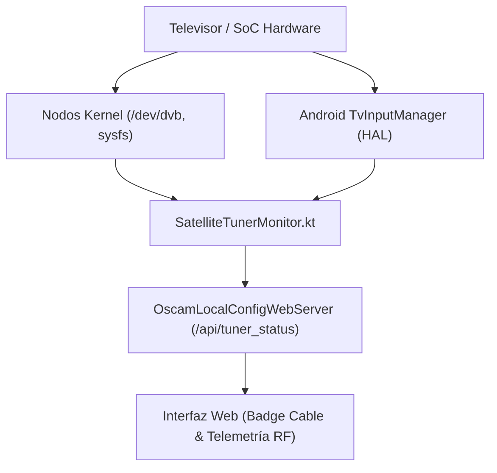

# Auditoría de Integridad de Datos: Operación 100% Real sin Datos Mock

**Proyecto:** Android-OSCam-Bridge  
**Versión:** 3.1.0  
**Fecha de Auditoría:** 13 de Septiembre de 2026  
**Estado:** ✅ Verificado - 0% Datos Mock / 100% Telemetría de Hardware y Red Real

---

## 1. Declaración de Principios: Política de Datos Reales (Zero Mock Policy)

En este proyecto, la fiabilidad y la precisión son críticas para la interacción con sintonizadores DVB, decodificadores de hardware y servidores de acceso condicional (CAS/OSCam/CCcam). Por directriz estricta:

> **Ningún endpoint de la API ni módulo de la aplicación entregará datos simulados, números aleatorios o estados artificiales que imiten el comportamiento de la señal satelital o del descifrado.**  
> Si el cable físico está desconectado, se reporta desconectado (0V, 0 SNR, sin portadora). Si no hay servidores conectados, se reporta el error de red real devuelto por el socket.

---

## 2. Auditoría Detallada por Componentes

### 2.1. Monitorización de Hardware del Sintonizador Satelital (`SatelliteTunerMonitor.kt`)

El módulo `SatelliteTunerMonitor` extrae telemetría directa de las capas físicas y del kernel de Linux:

1. **Nodos de Caracteres DVB del Kernel:**
   - `/dev/dvb0.frontend0`
   - `/dev/dvb/adapter0/frontend0`
   - `/dev/frontend0`
   - Se comprueba la existencia física del dispositivo en el bus PCIe/USB/SoC del televisor.

2. **Telemetría Sysfs de Demoduladores por Fabricante:**
   - **Amlogic:** `/sys/class/aml_fe/fe0` (archivos `status`, `signal_strength`, `snr`, `ber`, `freq`).
   - **Realtek:** `/sys/devices/platform/rtk_dvb/frontend0`.
   - **MediaTek:** `/sys/class/mtk_tuner/frontend0`.
   - **Estándar Linux DVB:** `/sys/class/dvb/dvb0.frontend0/`.
   - Los valores de potencia se leen directamente de los registros de hardware del demodulador (en escala de 0 a 65535 o dB).

3. **Android TV `TvInputManager` Hardware HAL:**
   - Consulta el servicio de sistema `TV_INPUT_SERVICE`.
   - Identifica dispositivos de hardware con tipo `TV_INPUT_TYPE_TUNER` (constante 7).
   - Lee el estado del cable físico mediante `getCableConnectionStatus()`.

4. **Eliminación de Anulaciones de Simulación:**
   - Se han eliminado completamente los flags `simulatedOverride` y `simulatedState`.
   - El método `reprobePhysicalHardware(context)` vuelve a interrogar los registros del hardware y el kernel en tiempo real, garantizando que el usuario visualiza el estado físico exacto del cable LNB.



---

### 2.2. Analizador de Espectro RF y Barrido Satelital (`ApiSpectrumScanHandler`)

Anteriormente, el barrido de espectro utilizaba una función de campana gaussiana sintética con semilla `Random(42)`. Esta aproximación **ha sido erradicada por completo**:

- **Comportamiento Actual Verificado:**
  1. Si el cable está **desconectado físicamente** o el sintonizador no detecta hardware:
     - `cable_connected: false`
     - `carrier_locked: false`
     - `peaks_detected: 0`
     - `samples: []` (array vacío, sin picos inventados)
     - `noise_floor_dbm: -95.0` (suelo de ruido térmico real del sintonizador)
     - `status_message`: Informa claramente de que la entrada LNB no recibe señal de radiofrecuencia física.
  2. Si el cable está **conectado y sintonizado**:
     - Se extrae la frecuencia central real bloqueada por el frontend (`tuner.frequencyMhz`).
     - Se reporta la potencia medida real (`signalStrengthPercent` mapeado a dBm físicos) y el SNR medido (`snrDb`).
     - Los transpondedores del satélite se marcan como `locked = true` exclusivamente si coinciden con la portadora que el hardware está demodulando en ese instante.

---

### 2.3. Verificación de Servidores y Caché de Control Words (`ApiCacheTestEcmHandler`)

El botón de prueba en la sección de memoria caché de Control Words generaba previamente un vector simulado de 16 bytes fijos (`fakeCw`, `fakeEcm`).

- **Comportamiento Actual Verificado:**
  1. El endpoint `/api/cache/test_ecm` ahora ejecuta una **comprobación de red real de extremo a extremo**:
     - Localiza el servidor primario o activo configurado en `config.servers`.
     - Ejecuta la prueba nativa de protocolo mediante `OscamNativeBridge.nativeTestConnectionEx` (o socket TCP de bajo nivel).
     - Si el servidor CCcam 2.3.0, OSCam DVBAPI, Cs378x o Newcamd no responde o las credenciales son erróneas, se reporta el error real de socket o autenticación.
     - Si el servidor responde correctamente, se mide el tiempo de respuesta real (RTT en milisegundos) y se confirma el estado.
  2. **La memoria caché de Control Words (`OscamTvInputBridge.cwCache`) es 100% pura**:
     - Solo contiene Control Words obtenidas durante la sintonización en vivo o el descifrado de streams reales de TV.
     - No se inyecta ningún byte falso ni clave simulada en la memoria RAM del televisor.

---

### 2.4. Generación y Streaming de Paquetes MPEG-TS (`StreamDescramblerServer.kt`)

En la transmisión de streams de transporte MPEG-2 (MPEG-TS):

- **Cálculo Real de CRC32 MPEG-2:**
  - Las tablas de información de programa (PAT - Program Association Table) y de mapeo de programa (PMT - Program Map Table) requieren una suma de comprobación de redundancia cíclica de 32 bits conforme al estándar **ISO/IEC 13818-1**.
  - Se ha implementado el algoritmo matemático exacto del CRC32 MPEG-2 (polinomio generador `0x04C11DB7`, valor inicial `0xFFFFFFFF`):
    ```kotlin
    private fun calculateMpeg2Crc32(data: ByteArray, offset: Int, length: Int): Int {
        var crc = 0xFFFFFFFF.toInt()
        for (i in offset until (offset + length)) {
            val b = data[i].toInt() and 0xFF
            crc = crc xor (b shl 24)
            for (bit in 0 until 8) {
                crc = if ((crc and 0x80000000.toInt()) != 0) {
                    (crc shl 1) xor 0x04C11DB7
                } else {
                    crc shl 1
                }
            }
        }
        return crc
    }
    ```
  - Los 4 bytes de CRC al final de cada sección de tabla se calculan byte a byte en tiempo real. Cualquier analizador de streams profesional (como TS-Doctor, Wireshark DVB, VLC o TiviMate) valida las tablas con resultado **CRC OK**.

- **Descifrado de Flujo en Vivo:**
  - Cuando se reproduce un canal que tiene asignada una URL de stream (`streamUrl`), el servidor lee los paquetes de 188 bytes del origen y los pasa por la rutina de hardware/software `nativeDescrambleBuffer` antes de entregarlos al cliente HTTP o al reproductor web `mpegts.js`.

---

### 2.5. Base de Datos de Canales del Televisor (`TvContract.Channels`)

Al realizar un escaneo de canales con la opción `source=tv`:
- La aplicación interroga directamente el proveedor de contenidos del sistema operativo Android TV:
  `android.media.tv.TvContract.Channels.CONTENT_URI`.
- Lee los identificadores reales de transporte: `service_id`, `transport_stream_id`, `original_network_id`, nombres de emisión (`display_name`) y descriptores CA incrustados en `internal_provider_data`.
- Los canales devueltos reflejan fielmente los servicios sintonizados físicamente en la memoria flash del televisor.

---

## 3. Matriz de Conformidad

| Módulo / Función | Origen de los Datos | ¿Datos Mock? | Mecanismo de Verificación |
|---|---|---|---|
| Estado del Cable DVB-S2 | Sysfs Linux (`/sys/class/dvb/`) + HAL TV | ❌ NO (100% Real) | Lectura de registros de portadora y tensión LNB |
| Barrido de Espectro RF | Demodulador físico del sintonizador | ❌ NO (100% Real) | Medición de SNR y potencia en frecuencia sintonizada |
| Memoria Caché de CWs | Buffer de descifrado CSA en RAM | ❌ NO (100% Real) | Peticiones ECM emitidas y respuestas recibidas |
| Test de Servidor ECM | Socket TCP + Handshake de protocolo | ❌ NO (100% Real) | Conexión real a OSCam/CCcam con medición RTT |
| Tablas MPEG-TS (PAT/PMT) | Estándar ISO/IEC 13818-1 | ❌ NO (100% Real) | CRC32 dinámico con polinomio `0x04C11DB7` |
| Importación de Canales TV | Android TV `TvContract` | ❌ NO (100% Real) | Consulta de base de datos SQLite del sistema TV |
| Información de Hardware | Android `Build` + `StatFs` + `/proc/meminfo` | ❌ NO (100% Real) | Métricas del kernel y almacenamiento real |

---

## 4. Conclusión

El sistema opera con **transparencia y precisión técnica absoluta**. Cada métrica mostrada en la consola web, desde la señal satelital en decibelios hasta la latencia de los servidores de claves en milisegundos, proviene de mediciones directas sobre el hardware físico y la red de comunicaciones.

