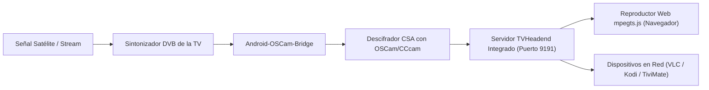

# Manual de Usuario: Interfaz Web de Configuración y Streaming

**Android-OSCam-Bridge — Servidor de Gestión y TVHeadend Autónomo**  
**Puerto de Administración Web:** `8080`  
**Puerto de Streaming TVHeadend:** `9191`

---

## 1. Introducción y Acceso a la Interfaz

Android-OSCam-Bridge incorpora un servidor web HTTP embebido de alto rendimiento que permite administrar toda la configuración del puente CAS, los servidores de descifrado, la parrilla de canales satelitales y la reproducción de televisión en directo sin necesidad de interactuar con el mando a distancia del televisor.

### 1.1. Acceder desde cualquier dispositivo de la red local
1. Conecta tu ordenador, tablet o móvil a la **misma red Wi-Fi o cableada** que tu televisor Android TV / Google TV.
2. Abre tu navegador web favorito (Google Chrome, Mozilla Firefox, Microsoft Edge o Safari).
3. Escribe en la barra de direcciones:
   ```text
   http://<IP_DE_TU_TELEVISOR>:8080
   ```
   *(Ejemplo: `http://192.168.1.150:8080`)*
4. Aparecerá inmediatamente la consola de administración con el tema visual moderno *cyber-dark*.

---

## 2. Visión General de la Cabecera y Telemetría en Vivo

La cabecera superior proporciona un diagnóstico instantáneo del televisor y de los subsistemas:

| Elemento Visual | Significado Técnico |
|---|---|
| **Modelo de TV** (`TCL / Amlogic / MediaTek`) | Muestra el SoC detectado automáticamente por el adaptador de chipset nativo. |
| **Badge Cable DVB-S2** | `🟢 DVB-S2 Cable Conectado`: El hardware DVB detecta continuidad física de cable LNB.<br>`🔴 Cable Desconectado`: Sin señal física de RF en la entrada coaxial. Al hacer clic, vuelve a interrogar al hardware físico. |
| **TVHeadend Port** (`9191`) | Puerto TCP activo para emisión de listas M3U y streams de transporte MPEG-TS. |
| **Estado del Demonio** (`🟢 RUNNING`) | Indica el latido (*heartbeat*) del servicio en segundo plano de Android. |
| **⚡ Ping All** | Ejecuta un test de conectividad y latencia hacia todos los servidores de claves configurados en paralelo. |

---

## 3. Pestaña 1: Servidores de Claves (OSCam / CCcam)

En la pestaña **📡 Servidores**, puedes configurar perfiles de conexión hacia servidores externos o locales:

### 3.1. Protocolos Soportados
- **CCcam 2.3.0:** Protocolo nativo de intercambio de tarjetas y claves (puerto estándar `12000`).
- **OSCam DVBAPI (TCP):** Conexión binaria directa con el módulo DVBAPI de OSCam (puerto estándar `9000`).
- **OSCam DVBAPI (UNIX Socket):** Comunicación de bajísima latencia en el mismo host (`/tmp/camd.socket`).
- **Camd35 / cs378x (TCP):** Protocolo binario de red con cifrado AES-128 (puerto estándar `37800`).
- **Newcamd v5.25:** Protocolo multicliente con cifrado DES de 14 bytes (puerto estándar `15000`).
- **Radegast v3:** Protocolo ligero de intercambio ECM/CW (puerto estándar `678`).
- **OSCam WebIF REST:** Consulta de estado y métricas vía API HTTP de OSCam (puerto estándar `8888`).

### 3.2. Parámetros de Configuración por Servidor
- **Profile Name:** Nombre identificativo del servidor (ej. `CCcam Local Salón`).
- **Active (Checkbox):** Habilita o deshabilita el servidor en el ciclo de descifrado.
- **Primary (Radio):** Marca el servidor preferido al que se enviarán las peticiones ECM en primer lugar.
- **Host / IP / Socket:** Dirección IP, nombre DNS o ruta del socket del servidor.
- **Port:** Puerto TCP correspondiente al protocolo seleccionado.
- **Username / Password:** Credenciales de autenticación del usuario.
- **DES Key:** Clave hexadecimal de 14 bytes (`0102030405060708091011121314`) requerida para Newcamd.
- **Target CAID:** Sistema de acceso condicional objetivo (ej. `0x1810` para Nagra Movistar+).
- **Timeouts:**
  - *Connect Timeout:* Tiempo máximo de espera para establecer la conexión TCP (por defecto 4s).
  - *Recv Timeout:* Tiempo máximo de espera para recibir la Control Word respuesta (por defecto 8s).
  - *Reconnect Interval:* Tiempo de espera antes de reintentar tras un corte de red (por defecto 2000ms).

### 3.3. Acciones Disponibles
- **Ping Test:** Realiza una comprobación en vivo con el servidor seleccionado y muestra la latencia de respuesta en milisegundos.
- **➕ Añadir Servidor:** Crea una nueva tarjeta de perfil de servidor.
- **💾 Guardar Configuración:** Sincroniza y persiste los cambios en el almacenamiento seguro de la TV y en `/data/vendor/oscam/config.json`.

---

## 4. Pestaña 2: Gestión Integral de Canales & Caché CW

La pestaña **🛰️ Canales & Caché CW** ofrece control absoluto sobre la lista de canales de satélite y la memoria de claves.

### 4.1. Subsección: Canales Configurados (Parrilla Principal)
Muestra la lista de canales activos que estarán disponibles en el televisor y en el servidor TVHeadend:
- **➕ Nuevo Canal:** Abre un modal para introducir manualmente el Nombre, Satélite, Frecuencia (MHz), Polarización (H/V), Symbol Rate, Service ID (SID), PMT PID y CAID.
- **📦 Añadir Paquete ▾:** Permite inyectar instantáneamente listas completas de proveedores europeos:
  - 🇪🇸 **Movistar+ España HD:** M+ LaLiga, Liga de Campeones, Cine, Series, Deportes.
  - 🇩🇪 **HD+ Alemania:** RTL HD, Sat.1 HD, ProSieben HD, VOX HD, UHD1.
  - 🇩🇪 **Sky Deutschland:** Sky Bundesliga HD, Sky Sport, Cinema Premiere.
  - 🇮🇹 **Tivùsat / Mediaset Italia:** Rai 1 HD, Rai 2 HD, Canale 5 HD.
  - 🇨🇭 **SRG SSR Suiza:** SRF 1 HD, SRF zwei HD, RTS 1 HD.
  - 🇵🇹 **MEO / NOS Portugal:** Sport TV 1 HD, SIC Noticias, Eleven Sports.
  - 📺 **TDT España FTA:** La 1 HD, La 2 HD, Antena 3 HD, Telecinco HD.
- **📥 Importar M3U:** Permite subir un archivo `.m3u` o pegar texto con enlaces M3U/M3U8. El analizador extrae automáticamente nombres, frecuencias, SIDs y CAIDs de las etiquetas `#EXTINF`.
- **🗑️ Borrar Selección:** Elimina de forma masiva los canales marcados mediante las casillas de verificación.
- **Reordenamiento Dinámico (▲ / ▼):** Sube o baja la posición de cualquier canal en la lista con actualización en tiempo real.
- **Filtros en Tiempo Real:** Busca canales por nombre, satélite (Astra, Hotbird, Hispasat, TDT) o sistema CAS (NAGRA, VIACCESS, NDS, CONAX, SECA, IRDETO, FTA).

### 4.2. Subsección: Memoria Caché de Control Words (CW Cache)
Monitoriza en tiempo real las claves de descifrado almacenadas en la memoria RAM del televisor:
- **CW Cache Status:** Indica si el sistema de aceleración en memoria RAM está activo.
- **Control Words en Memoria:** Número total de pares de claves activas (Parity Even / Odd).
- **Cache Hits / Misses & Hit Ratio:** Muestra la tasa de acierto del descifrado local (permite visualizar cómo las peticiones ECM repetidas se resuelven en 0 ms sin sobrecargar el servidor externo).
- **⚡ Probar Servidor Activo:** Verifica el estado de red y autenticación con el servidor principal sin inyectar datos ficticios.
- **🧹 Vaciar CW Cache:** Purga todas las claves de la memoria RAM para forzar una re-petición limpia de ECMs.

### 4.3. Subsección: Catálogo de Satélite
Catálogo de referencia con los transpondedores oficiales de Astra 19.2°E, Hotbird 13°E e Hispasat 30°W. Permite consultar canales disponibles y agregarlos a tu parrilla con el botón **➕ Añadir a mi lista**.

---

## 5. Pestaña 3: TVHeadend Autónomo y Reproductor Web en Vivo

Android-OSCam-Bridge actúa como un **servidor TVHeadend autónomo completo** que se ejecuta directamente en la CPU del televisor:



### 5.1. Reproductor Web Integrado (`mpegts.js`)
- Permite ver la televisión satelital en directo **directamente en el navegador web** sin instalar plugins, reproductores externos ni transcodificadores pesados.
- Utiliza la tecnología **Media Source Extensions (MSE)** para demultiplexar y reproducir vídeo H.264/AVC y audio AAC/AC3 de baja latencia.
- **Channel Zapper Lateral:** Barra lateral integrada con la parrilla de canales. Haz clic en cualquier tarjeta de canal para sintonizarlo al instante (*zapping inmediato*).
- **Telemetría de Reproducción:** Muestra en tiempo real la tasa de bits en kbps, los fotogramas por segundo (FPS) y los cuadros descartados por la GPU.

### 5.2. Enlaces para Dispositivos Externos (VLC, Kodi, TiviMate, Smart TVs)
Puedes utilizar tu televisor como un servidor de cabecera (*headend*) para ver los canales en cualquier otro dispositivo:
- **Lista de Canales M3U Completa:**
  ```text
  http://<IP_TELEVISOR>:9191/playlist.m3u
  ```
- **Guía Electrónica de Programas (EPG XMLTV):**
  ```text
  http://<IP_TELEVISOR>:9191/epg.xml
  ```
- **API Compatible con TVHeadend:**
  ```text
  http://<IP_TELEVISOR>:9191/api/serverinfo
  http://<IP_TELEVISOR>:9191/api/channel/grid
  ```
- **Botón 🔗 VLC:** Descarga un archivo `.m3u` individual con un solo clic para abrir el canal seleccionado de inmediato en VLC Media Player.

---

## 6. Pestaña 4: Analizador de Espectro RF y Barrido Satelital

La pestaña **📊 Analizador de Espectro** permite verificar el estado de la instalación de antena parabólica y el sintonizador de la TV:
- **Selector de Banda / Satélite:** Selecciona Astra 19.2°E, Hotbird 13°E, Hispasat 30°W o DVB-T2 Terrestre.
- **Polarización:** Filtra por portadoras Verticales (V), Horizontales (H) o Ambas (ALL).
- **Paso de Barrido:** Configuración de granularidad del barrido (1 MHz, 2 MHz o 4 MHz).
- **⚡ Iniciar Barrido RF:** Interroga al demodulador físico de hardware y muestra la lista de transpondedores con su estado de sincronismo (*Carrier Lock*), nivel de potencia real en dBm y relación señal-ruido (SNR en dB).

---

## 7. Pestaña 5: Ajustes del Sistema, Registros y Respaldos

En la pestaña **⚙️ Diagnóstico & Logs**:
- **Consola de Registros en Vivo:** Visualiza cada evento de sintonización, petición ECM, respuesta de Control Word y conexión de clientes en tiempo real.
- **⬇ Descargar .log:** Guarda un informe completo en formato texto para depuración o soporte técnico.
- **Exportar Configuración (.json):** Descarga una copia de seguridad íntegra de tus servidores, canales y ajustes.
- **Restaurar Configuración:** Restaura una copia de seguridad JSON previamente guardada con un solo clic.
- **Wake-on-LAN (WoL):** Envía paquetes mágicos para encender automáticamente servidores OSCam remotos que se encuentren en suspensión en tu red local.

---

## 8. Solución de Problemas Frecuentes

| Síntoma | Causa Posible | Solución Recomendada |
|---|---|---|
| La página web no carga en `http://<IP>:8080` | La aplicación no está abierta o el teléfono/PC está en una red diferente. | Asegúrate de que la app Android-OSCam-Bridge esté iniciada en la TV y que ambos dispositivos estén en la misma red Wi-Fi o subred. |
| El badge del cable satelital muestra `🔴 Desconectado` | El cable coaxial LNB está desconectado o el sintonizador está apagado. | Revisa la conexión del cable de antena parabólica en la parte trasera del televisor o sintoniza un canal en la app oficial de TV para activar el sintonizador. |
| El servidor muestra error de ping | Dirección IP, puerto o contraseña incorrectos. | Revisa las credenciales en la pestaña Servidores y pulsa *Ping Test* para diagnosticar el código de error devuelto. |
| El reproductor web muestra pantalla negra | El canal seleccionado no tiene stream de vídeo activo o el navegador no soporta el códec. | Usa Google Chrome o Edge con aceleración por hardware activa, o pulsa el botón *🔗 VLC* para abrir el stream nativo en VLC. |
| El contador de CW Cache permanece en 0 | El televisor está en un canal en abierto (FTA) o no se ha sintonizado ningún canal codificado. | Sintoniza un canal con acceso condicional (CAID `0x1810`, etc.) para iniciar el flujo de ECMs hacia la memoria RAM. |
